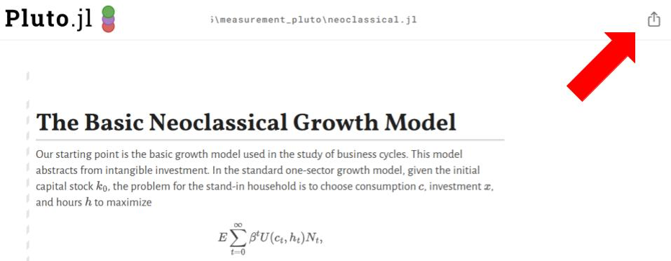

# Measuring Business Value and Productivity Beta Site

Below are instructions to **update the site itself**. For instructions on using the site, consult the site's [introduction page](https://isaiahdal.github.io/).

## I. Setup

Install the following software and packages:

* [Julia](https://julialang.org/)

You can install Julia directly through a terminal by enterting the following lines:

**Windows**
```
winget install julia -s msstore
```

**MacOS/Linux**
```
curl -fsSL https://install.julialang.org
```

You can also manually install Julia from its [download page](https://julialang.org/downloads/).

Once installed, you can open the Julia REPL (Read-Eval-Print Loop) by entering `julia` into the terminal.

* [Pluto.jl](https://plutojl.org/)

Enter the following line into the Julia REPL to add the Pluto package:

```
import Pkg; Pkg.add("Pluto")
```

* [VSCode](https://code.visualstudio.com/)

  * You may also use another code editor with support for Julia and HTML/CSS/JS. However, this guide assumes that you are using VSCode.

## II. Adding a New Page

> **IMPORTANT**: When adding or editing pages, see [style.md](https://github.com/IsaiahDal/isaiahdal.github.io/blob/main/style.md) for some basic coding and style standards.

### 1. Open Pluto's Code Editor

* Open the Julia REPL by entering `julia` into your terminal.

* Paste the following line into the Julia REPL to open Pluto's code editor:

```
using Pluto; Pluto.run()
```

A tab similar to the one pictured below should open in your browser:


### 2. Create a New Notebook

Click "+ _Create a **new notebook**_, which will open the following in a new tab:


### 3. Add to the Notebook

#### a. Add New Cells

* Place your cursor over the cell immediately above or below where you wish to add the new cell.

  * Click the "Add cell" (+) button that appears to the top left of the cell to add the new cell above the current cell.
  
  * Click the button that appears to the bottom left of the cell to add the new cell below the current cell.
 
    * You can also use `Ctrl + Enter` (or `Cmd + enter`) to add a cell below the current cell.
   
* Pluto allows you to divide code into separate cells.

  * The two most important types of code cells are:
 
    * **Julia** cells, which contain the executable code of the notebook.
 
    * **Markdown** cells, which are used to annotate the Julia code.
 
##### i. Julia Cells

* Each code cell is assumed to be written in Julia by default.

* All cells of more than one line must be wrapped in a single code block, such as a `function` or a `begin`-`end` block.

* Cells are run in sequential order.

##### ii. Markdown Cells

* Pluto also supports Markdown cells, which use the following syntax:

```
md"""
Your markdown text here
"""
```

* Within these cells, you can use all formatting options available in traditional .md files.

* Pluto Markdown cells natively support $\LaTeX$, which allows you to format mathematical expressions.

#### b. Deleting Cells

* Hover your cursor over the cell you wish to delete, and click the "Actions" button that appears in the top right of the cell.

* Select "Delete cell".

#### c. Toggling Cell Visibility

* Hover your cursor over the cell you wish to toggle

* Click the "Show/hide code" (👁) button that appears to the left of the cell to toggle visibility.

  * When a code cell is hidden, the cell's output remains visible. Only the code itself is hidden.

  * The visibility status of each cell is preserved when exporting to HTML in step 4.

> **NOTE**: The above is meant only as a brief introduction to using Pluto notebooks. For a more thorough tutorial of Pluto, visit its [official documentation](https://plutojl.org/en/docs/).


### 4. Export to HTML

> **IMPORTANT**: Make sure that all code (including Markdown) that you do not wish to display is hidden before exporting.

* Click the export button located at the top right of the Pluto.jl notebook (pictured below).
 
* Select **Static HTML**, then **Download HTML File**.
 
  * Note that the downloaded HTML file will have the same name as the corresponding .jl file.



### 5. Update index.html

The following example assumes you wish to add _keynes.html_, which has the title "In the long run, we are all dead", to the site.

* Dowload index.html and open in your code editor.

* Use `Ctrl + F` (or `Cmd + F`) and enter:
```
Add new HTML page buttons here
```

* This will bring you to the toc (Table of Contents) div.

* Add a button for the new page **in the location you wish it to appear in the table of contents**, using the following syntax:

```
<button id="keynes" class="toc-entry"><p>In the long run, we are all dead</p></button>
```

### 6. Upload Files to GitHub

This includes:

* Uploading the Pluto notebook source file (.jl) and static HTML (.html) to the `notebooks` subdirectory.

* Uploading the updated `index.html` to the top of this repository.

* Uploading any _new_ data files to the `DATA` subdirectory.

---

## III. Editing an Existing Page

> **IMPORTANT**: When adding or editing pages, see [style.md](https://github.com/IsaiahDal/isaiahdal.github.io/blob/main/style.md) for some basic coding and style standards.

### 1. Download Files

#### a. Download and Open the Notebook

* This can be done in one of two ways.

  * Visit the corresponding page on the [live site](https://isaiahdal.github.io/).

    * Click the "**Edit** or **run** this notbeook" button at the top right of the page.

    * Follow the instructions that appear under **On your computer**.
   
      * This will download the lecture to your device as "notebook.jl".
    
      * Rename the notebook using your file explorer, or using the following shell commands **in the directory where the notebook is located**:

**Windows**
```
Rename-Item "notebook.jl" "newname.jl"
```

**MacOS/Linux**
```
mv notebook.jl newname.jl
```

  * **OR**

  * Download the .jl source file from the `notebooks` subdirectory of this repository.

    * Follow step 1 under "Adding a Page" to open Pluto's code editor.
 
    * Copy and paste the path to the file into **Open a notebook** and click "Open".

      * By default, Pluto will interpret the path relative to your current working directory.
 
      * You may also copy and paste the absolute path to the file. This may help avoid any confusion as to the file's location.

#### b. Download Data

* You can download a ZIP file of all data used throughout the lectures by clicking the "Download Data" button on [the live site](https://isaiahdal.github.io/).

* Then, you can extract the data files into a directory called "DATA" by using the following shell commands **in the directory where the ZIP file is located**:

**Windows**
```
Expand-Archive -Path MeasurementData-main.zip -DestinationPath DATA
```

**MacOS/Linux**
```
mkdir -p DATA
unzip MeasurementData-main.zip -d DATA
```

Alternatively, you can download individual files from [this repository](https://github.com/IsaiahDal/MeasurementData).

#### c. Organize Files

* As it is currently written, all code in the lectures assumes the following organizational structure:

  * All data is in a directory called "DATA".

   * All code is in a single directory.

     * While this directory does not need to have a specific name, assume it is called "notebooks" for the duration of this example.

  * Both the "DATA" and "notebooks" directories are at located the top level of the SAME directory.
 
  * Ensure that your files are organized as such before proceeding, using a terminal or file explorer to move files if necessary.

    * Alternatively, you may choose to edit the lines of code that load the data to reflect the relative location of the data as is. This approach is not recommended, as it requires updating each affected line of code individually.

### 2. Make Your Desired Edits

See step 3 under "Adding a Page" for a brief introduction to Pluto notebooks.

### 3. Export to HTML

See step 4 under "Adding a Page".

### 4. Upload Files to GitHub

This includes:

* Uploading the updated Pluto notebook source file (.jl) and static HTML (.html) to the `notebooks` subdirectory.

* Uploading any _new_ data files to the `DATA` subdirectory.

---

## IV. Files in this directory

### DATA

All data files used in the site and Data Center.

### datacenter.html (WIP)

Used to visualize, manipulate, and download datasets.

### index.html

The main HTML page. Used to house navigate between the static HTML notebooks.

### images

All images used in this README.

### notebooks

All Pluto.jl notebooks, including both the source code and static HTML.

### style.md

Some basic coding and style standards.

### main.css

CSS styles for index.html and datacenter.html.

### lectures.css

CSS styles for index.html.

### datacenter.css

CSS styles for datacenter.html.

### datacenter.md

Instructions for adding to or editing datacenter.html.
